# Настройка подключения к сервисам

Подключения к аккаунтам сторонних сервисов осуществляется во вкладке “Сервисы” настроек Sherpa Assistant.

## **Yandex Cloud**

Для настройки подключения к аккаунту Yandex Cloud перейдите во внутреннюю вкладку “Yandex Cloud” и укажите настройки подключения к аккаунту.

<figure><figcaption></figcaption></figure>

При необходимости Вы можете проверить лимиты и проверить подключение с помощью соответствующих кнопок.

<figure>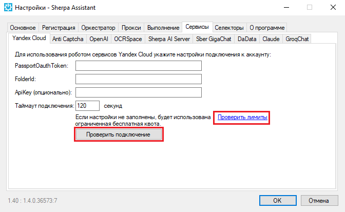<figcaption></figcaption></figure>

## **Anti Captcha**

Для подключения к сервису Anti Captcha перейдите во внутреннюю вкладку “Anti Captcha” и укажите ключ сервиса.

<figure>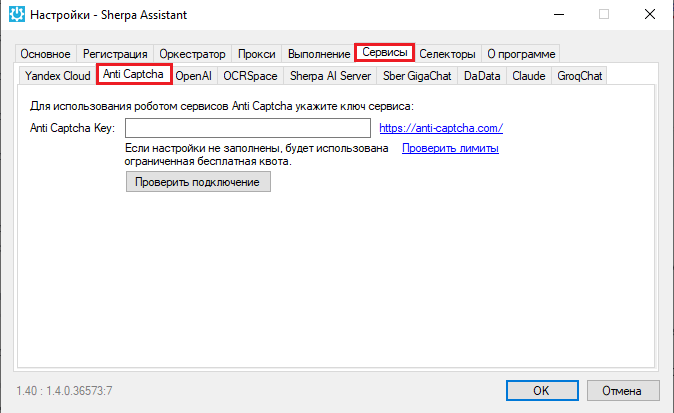<figcaption></figcaption></figure>

При необходимости Вы можете проверить лимиты и проверить подключение с помощью соответствующих кнопок.

<figure>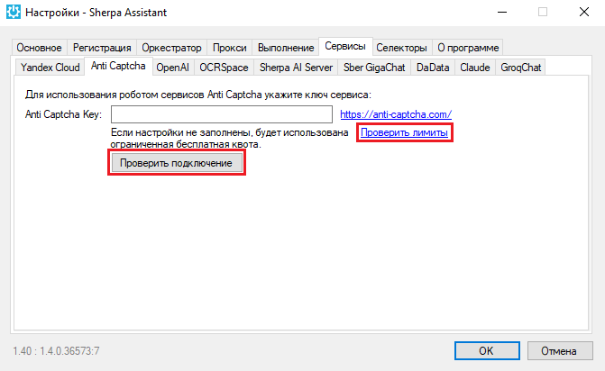<figcaption></figcaption></figure>

## **OpenAI**

Для подключения к сервису OpenAI перейдите во внутреннюю вкладку “OpenAI” и укажите токен для использования сервисов OpenAI внутри Робота.

<figure>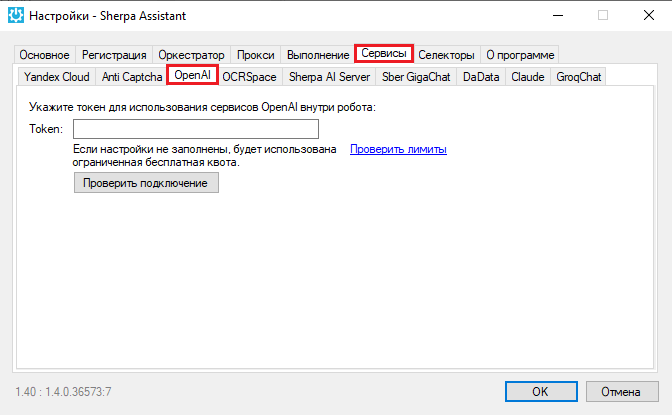<figcaption></figcaption></figure>

При необходимости Вы можете проверить лимиты и проверить подключение с помощью соответствующих кнопок.

<figure>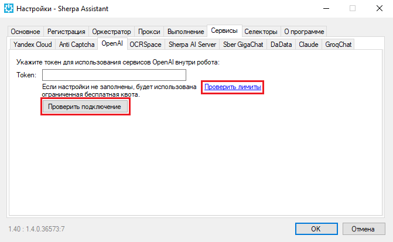<figcaption></figcaption></figure>

## **OCRSpace**

Для подключения к сервису OCRSpace перейдите во внутреннюю вкладку “OCRSpace” и укажите API-ключ для использования служб OCRSpace внутри Робота.

<figure>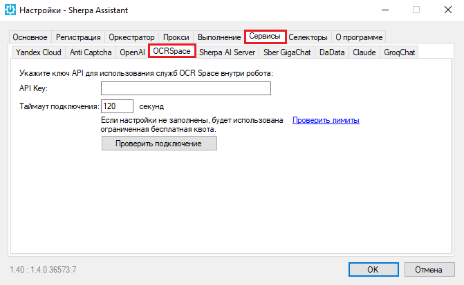<figcaption></figcaption></figure>

При необходимости Вы можете проверить подключение с помощью соответствующей кнопки.

<figure>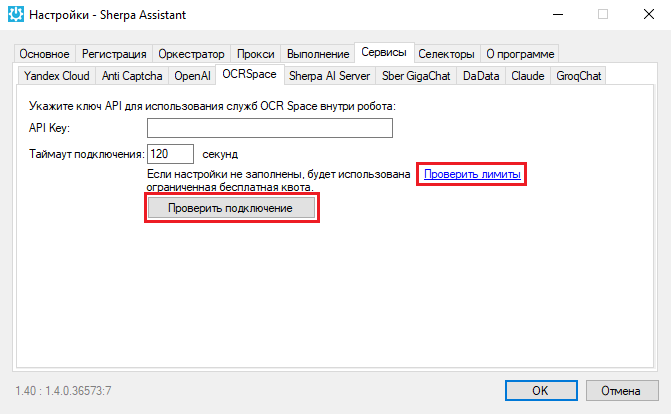<figcaption></figcaption></figure>

## **Sherpa AI Server**

**Sherpa AI Server** – это веб-сервисное приложение, предназначенное для обучения, использования и дообучения больших языковых моделей (LLM) внутри закрытого контура корпораций. Sherpa AI Server объединяет в себе векторное хранилище документов, управление офлайн-моделями, поддержку разнообразных моделей искусственного интеллекта – с разным размером, с квантованием и без, их запуск на GPU или CPU, проектирование цепочек обработки данных, дообучение моделей на пользовательских данных, доступ через API, платформу роботизации и веб-интерфейс, и многое другое.&#x20;

Для настройки подключения к аккаунту Sherpa AI Server перейдите во внутреннюю вкладку “Sherpa AI Server” и укажите токен для использования сервиса, а также домен сервера или IP.

При необходимости Вы можете проверить подключение с помощью соответствующей кнопки.

<figure><figcaption></figcaption></figure>

## **Sber GigaChat**

Для подключения к сервису Sber GigaChat перейдите во внутреннюю вкладку “Sber GigaChat” и укажите токен для использования сервисов Sber GigaChat внутри Робота.

<figure>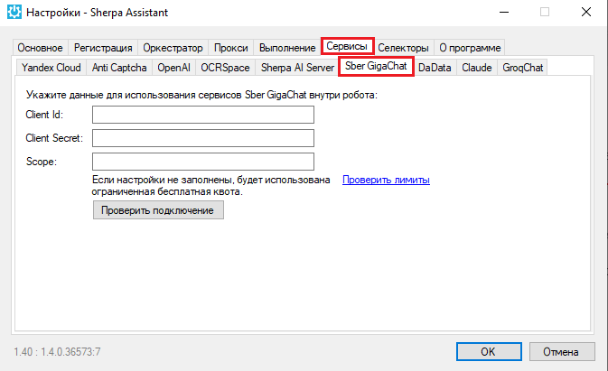<figcaption></figcaption></figure>

При необходимости Вы можете проверить лимиты и проверить подключение с помощью соответствующих кнопок.

<figure>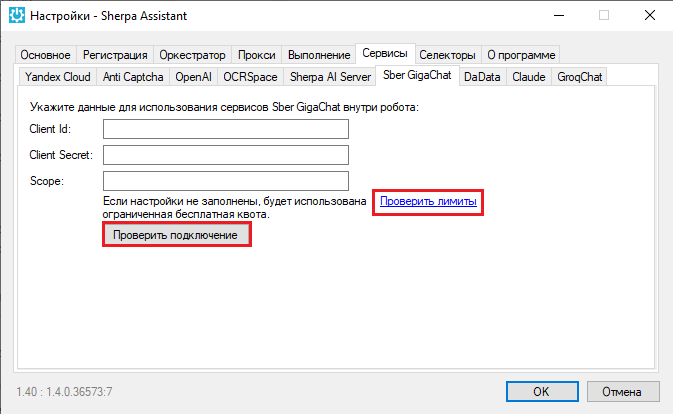<figcaption></figcaption></figure>

## **DaData**

Для подключения к сервису DaData перейдите во внутреннюю вкладку “DaData” и укажите токен для использования служб DaData внутри Робота.

<figure>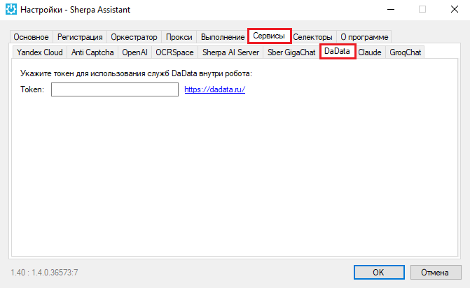<figcaption></figcaption></figure>

## **Claude**

Для подключения к сервису Claude перейдите во внутреннюю вкладку “Claude” и укажите ключ API для использования служб Claude внутри Робота.

<figure>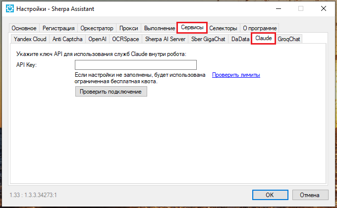<figcaption></figcaption></figure>

При необходимости Вы можете проверить лимиты и проверить подключение с помощью соответствующих кнопок.

<figure>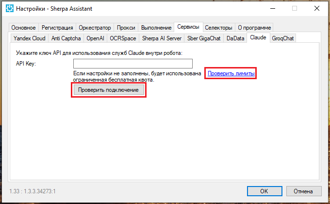<figcaption></figcaption></figure>

## **GroqChat**

Для подключения к сервису GroqChat перейдите во внутреннюю вкладку “GroqChat” и укажите ключ API для использования служб GroqChat внутри Робота.

<figure><figcaption></figcaption></figure>

При необходимости Вы можете проверить лимиты и проверить подключение с помощью соответствующих кнопок.

<figure>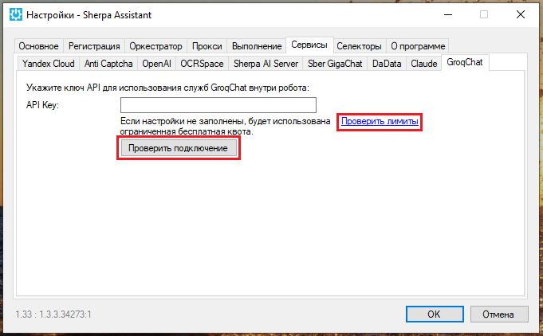<figcaption></figcaption></figure>

Подробнее о подключении и работе со сторонними сервисами:


