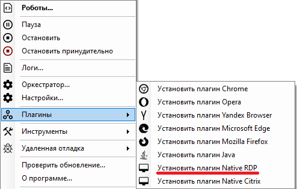

# Установка плагина Native RDP

Данная инструкция предполагает что на рабочем месте пользователя уже развернуто ПО Sherpa RPA в любой из доступных конфигураций: рабочее место разработчика, рабочее место Attended-робота или рабочее место Unattended-робота.

На клиентском компьютере, с которого будет осуществляться подключение к Citrix, необходимо установить плагин Sherpa Native RDP Plugin:

1\. Запустите Sherpa Assistant от имени администратора.

2\. В системном трее (иконка Sherpa) выберите пункт "Плагины".

3\. Выберите "Установить плагин Native RDP".

<figure><figcaption></figcaption></figure>

4\. Установка плагина должна быть выполнена только один раз, после чего администраторские права для работы плагина более не требуются.

> Плагин Native RDP устанавливается автоматически при установке Runtime.
